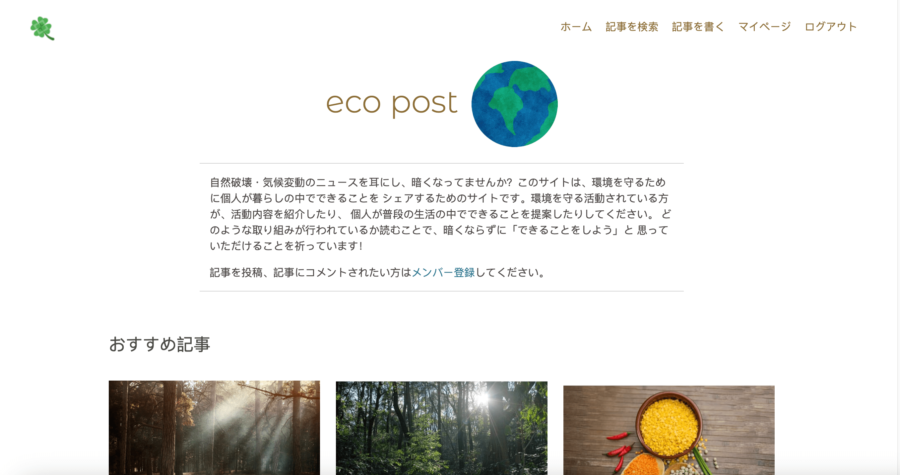

# エコポスト

デプロイしたプロジェクトは[こちら](https://eco-post-2023-10366a3320ac.herokuapp.com/)

## 概要
近年、気候変動のため、将来が不安になっている方が多いと思います。「どうせもうダメだ」と考えている人もいるようです。エコポストは問題に対して何かしら取り組んでいる方達の活動内容やアイデアをシェアするためのプラットフォームです。記事を読んだサイト閲覧者が、できることを新しく始めたり、前向きに考えたりするきっかけを与えることが、このサイトの目的です。

## このサイトの機能
### すべてのユーザー（未登録のサイト閲覧者を含めて）
- ホーム画面にアクセス
- おすすめ記事リスト閲覧
- 「今週の記事」ページ閲覧
- 「人気の記事」ページ閲覧
- 検索ページ閲覧、検索実施
- 各記事詳細画面閲覧
- メンバー登録

### 登録したメンバー
- ログイン、ログアウト
- 記事投稿、更新、削除
- 記事にコメントを投稿
- コメントを更新、削除
- 記事を「いいね」「ブックマーク」する（ブックマークした記事は「マイページ」にリストされる）
- 「マイページ」にアクセス。マイページには自分で書いた記事、コメントした記事、ブックマークした記事がリストされる。

## 使用言語、フレームワーク、ライブラリ
HTML/CSS, JavaScript, Python, Django, Bootstrap, jQuery, AJAX
## 今後修正すること

- ユニットテストを修正、追加
- マニュアルテスト追加、実施
- ユーザープロファイルの作成

## 本プロジェクト作成にあたり参考にした資料
「Code Star」
https://github.com/Code-Institute-Solutions/Django3blog/tree/master/12_final_deployment
