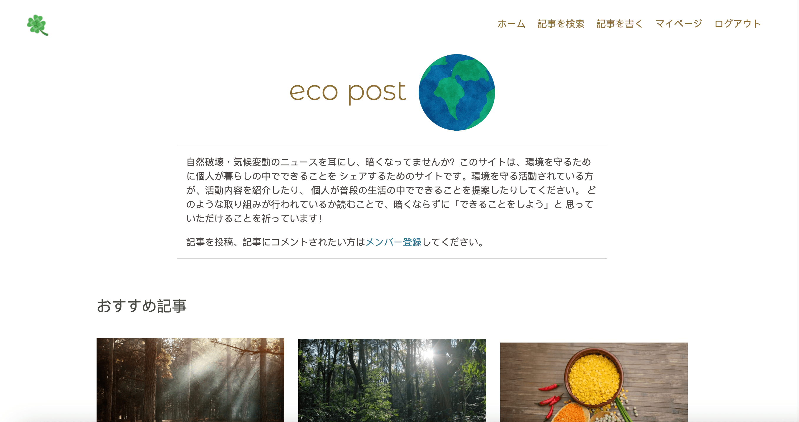

# Eco Post

This app allows users to post articles, read others' articles and exhange comments about the articles. 
[Click here](https://eco-post-2023-10366a3320ac.herokuapp.com/) to visit the deployed site.

## Main Features
### All Users (including unregistered users)
- visit Home, 'Articles from the past week,' 'Popular posts' pages
- read aricles
- search articles
- register

### Registered Users
- log in/out
- write, Update, Delete Articles
- leave comments on articles
- update, delete comments
- like and bookmark articles
- access 'My Page' which lists articles written by the user
  as well as articles commented or bookmarked by the user

## User Stories

## Wireframes
[Click here](https://wireframe.cc/pro/pp/873798723651976) to see the wireframes.

## Automated Testing

## Manual Testing

## Technology used
HTML5/CSS3, JavaScript, Python (Django), Bootstrap, jQuery, AJAX

## Media

- the graphics of colorful leaves
https://www.freepik.com/free-vector/watercolor-leaves-falling_18774856.htm#query=colorful%20leaves%20transparent%20background&position=8&from_view=search&track=ais

https://www.freepik.com/free-vector/watercolor-summer-leaves-collection-background_2198954.htm#query=colorful%20leaves%20transparent%20background&position=7&from_view=search&track=ais

## Credits
I leanned many methods used in this project through the following project.
「Code Star」
https://github.com/Code-Institute-Solutions/Django3blog/tree/master/12_final_deployment
