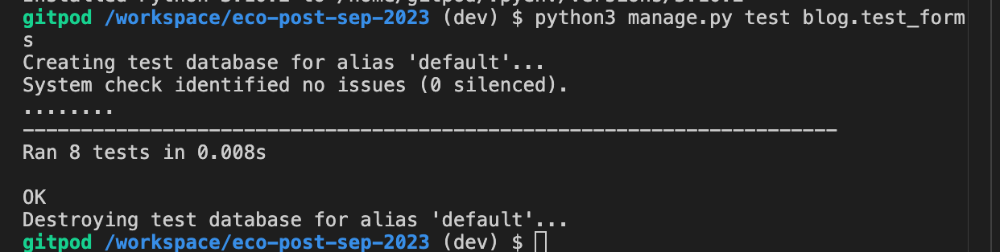
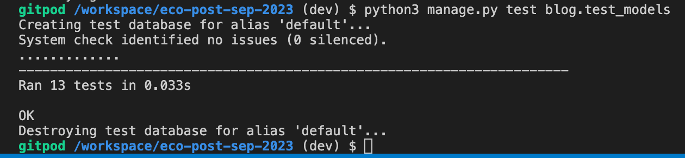
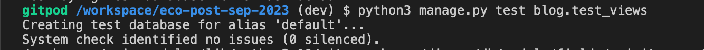
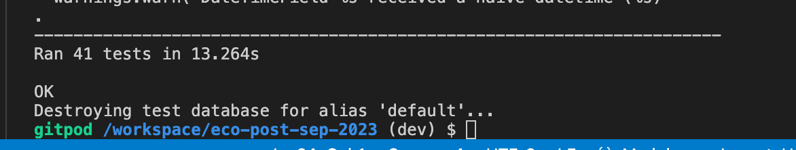

## 自動テスト項目

### test_forms
（必須項目に関してはテストにてエラーメッセージも確認） 
- PostForm
1. タイトルが必須であること
2. contentが必須であること
3. 画像が必須でないこと
4. カテゴリーが必須であること
5. cityが必須であること
6. メタクラスのフィールドが'title', 'content', 'featured_image','city', 'category'であること

- TestCommentForm
7. bodyが必須であること
8. メタクラスのフィールドが'body'であること

### test_models
- PostModelについて
1. 記事投稿の際、デフォルトでfeatured_flagがFalseに設定されること
2. 画像をアップロードしない際、featured_imageに「default」が設定されること
3. カテゴリーを選択しない際、othersが設定されること
4. statusにデフォルトで「0」が設定されること
5. 記事はcreated_onの降順で取得されること
6. 記事作成時slugが作成され設定されること
7. strメソッドが記事のタイトルを返すこと
8. num_of_likesに「いいね」の数が設定されること
9. excerptメソッドは記事の最初の80文字を返すこと
10. get_absolute_urlが正しいURLを返すこと

### test_views
1. url「/」にgetリクエストしてindex.htmlが表示されること
2. ホーム画面にfeaturedの記事３件が表示されること
3. ログインしていないとき「記事を投稿」画面を表示しようとするとログイン画面にリダイレクトされること
4. ログインしているとき「記事を投稿」画面が表示できること
5. 記事投稿画面でPostリクエストをして記事投稿ができること、その後記事の詳細画面にリダイレクトされること
6. 記事投稿画面で「投稿」をクリックするとステータスが「1」に設定されること
7. 記事投稿画面で「下書き保存」をクリックするとステータスが「0」に設定されること
8. 記事投稿画面で下書き保存するとメッセージに「記事を下書きとして保存しました。」が設定されること
9. 記事投稿画面で投稿するとメッセージに「記事が投稿されました。」が設定されること
10. 記事詳細画面が表示されること
11. 記事詳細画面にGetリクエスト送信時、ログインユーザが「いいね」をしていない記事は「liked」にFalseが設定されていること
12. 記事詳細画面にGetリクエスト送信時、ログインユーザが「いいね」をした記事は「liked」にTrueが設定されていること
13. 記事詳細画面にPostリクエスト送信時、ログインユーザが「いいね」をしていない記事は「liked」にFalseが設定されていること
14. 記事詳細画面にPostリクエスト送信時、ログインユーザが「いいね」をした記事は「liked」にTrueが設定されていること
15. 記事詳細画面にGetリクエスト送信時、ログインユーザがブックマーク設定していない記事は「bookmarked」にFalseが設定されていること
16. 記事詳細画面にGetリクエスト送信時、ログインユーザが「ブックマーク設定した記事は「bookmarked」にTrueが設定されていること
17. 記事詳細画面にPostリクエスト送信時、ログインユーザがブックマーク設定していない記事は「bookmarked」にFalseが設定されていること
18. 記事詳細画面にPostリクエスト送信時、ログインユーザがブックマーク設定した記事は「bookmarked」にTrueが設定されていること
19. 記事詳細画面にPostリクエストしてコメントが投稿できること
20. コメント投稿時メッセージに「コメントが投稿されました。」と設定されること
21. コメント欄が空のままコメント投稿すると、メッセージに「エラー発生。コメントは保存されませんでした。」と設定されること
22. コメント欄にスペースを入力し投稿すると、メッセージに「エラー発生。コメントは保存されませんでした。」と設定されること
23. 記事投稿者が詳細画面を表示すると記事の更新と削除ボタンが表示されること
24. コメントを削除するとコメントステータスが「2」に設定される
25. 記事投稿者がログインした状態で記事更新画面をGetリクエストすると更新画面が表示されること
26. ログアウトした状態で記事更新画面をGetリクエストするとログイン画面にリダイレクトされる
27. 記事投稿者以外がログインして記事更新画面をGetリクエストするとステータスコード403が返される
28. 記事のタイトルが更新できること
29. 内容(content)が更新できること
30. cityが更新できること
31. 更新画面で項目を入力後キャンセルを押下すると記事が更新されないこと
32. 更新内容を保存するとメッセージに「記事が更新されました。」と設定されること
33. 更新画面で「投稿」を押下するとメッセージに「記事が投稿されました。」と設定されること
34. 更新画面で「投稿」を押下するとステータスが「1」に設定される
35. 記事投稿者が記事を削除すると記事が削除されること
36. 記事投稿者以外が記事を削除しようとするとステータスコード403が返される
37. 記事投稿者以外が記事を削除しようとすると記事が削除されないこと
38. ログインせずに「過去２週間の記事」が表示できること
39. ログインせずに「人気の記事」が表示できること
40. ログインした状態で自分のマイページが表示できること
41. 他ユーザのマイページをGETリクエストするとステータスコード403が返されること

